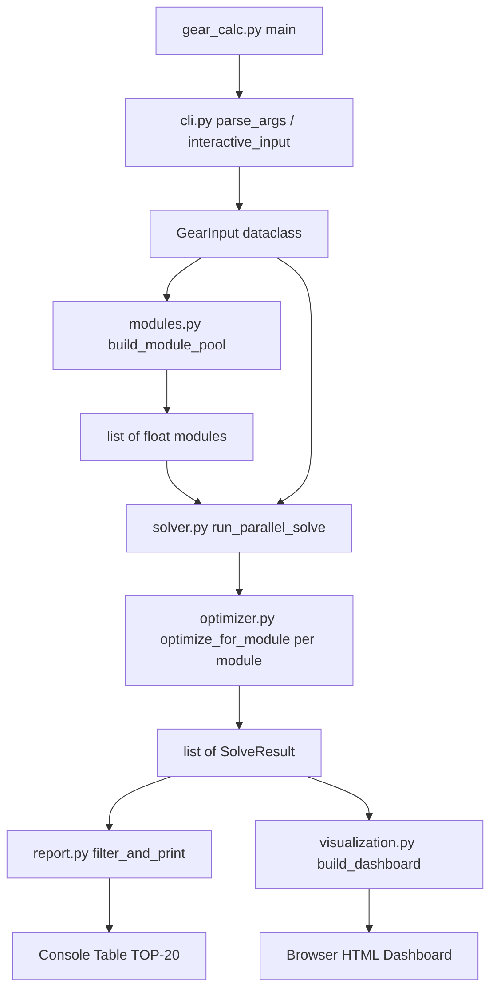

# GearSolver — Архитектурный план

## Структура файлов

```
GearSolver/
├── gear_calc.py          # Точка входа / оркестратор
├── config.py             # Константы и настройки
├── cli.py                # Парсинг CLI и интерактивный ввод
├── modules.py            # Генератор пула модулей
├── optimizer.py          # Математическая модель + scipy оптимизация
├── solver.py             # Мультипроцессорный диспетчер
├── report.py             # Фильтрация + вывод таблицы (rich)
├── visualization.py      # Plotly дашборд
└── requirements.txt
```

## Поток данных



## Ключевые структуры данных

### `GearInput` (dataclass)
| Поле | Тип | Описание |
|------|-----|----------|
| `da1` | `float` | Диаметр вершин шестерни 1 |
| `df1` | `float` | Диаметр впадин шестерни 1 |
| `z1` | `int` | Число зубьев шестерни 1 |
| `da2` | `float \| None` | Диаметр вершин шестерни 2 |
| `df2` | `float \| None` | Диаметр впадин шестерни 2 |
| `z2` | `int \| None` | Число зубьев шестерни 2 |
| `aw` | `float` | Межосевое расстояние (0 = не задано) |

### `SolveResult` (dataclass)
| Поле | Тип | Описание |
|------|-----|----------|
| `m` | `float` | Модуль |
| `x1` | `float` | Коэффициент смещения шестерни 1 |
| `x2` | `float \| None` | Коэффициент смещения шестерни 2 |
| `ha_star` | `float` | Коэффициент высоты головки зуба |
| `c_star` | `float` | Коэффициент радиального зазора |
| `total_error` | `float` | Суммарная невязка (мм) |
| `is_gost` | `bool` | Совпадает со стандартом ГОСТ |
| `dp_label` | `str \| None` | Метка дюймового питча, напр. `"DP 8"` |

---

## Описание модулей

### `config.py`
Все настраиваемые параметры как константы верхнего уровня:
- `TOLERANCE = 0.2` — допустимое суммарное отклонение (мм)
- `MODULE_STEP = 0.1`, `MODULE_MIN = 0.5`, `MODULE_MAX = 10.0`
- `GOST_MODULES: list[float]` — стандартный ряд ГОСТ 9563-60
- `DP_PITCHES: list[int]` — частые дюймовые питчи [4,5,6,8,10,12,16,20,24,32,48]
- `X_BOUNDS = (-1.5, 1.5)`, `HA_BOUNDS = (0.5, 1.2)`, `C_BOUNDS = (0.15, 0.4)`
- `TOP_N = 20`

### `cli.py`
**`parse_cli_args() -> GearInput | None`**
- `argparse` с позиционными аргументами: 4 аргумента (одна шестерня) или 7 аргументов (пара)
- Сигнатуры: `da1 df1 z1 [aw]` или `da1 df1 z1 da2 df2 z2 [aw]`
- Возвращает `None` если аргументы не переданы (для перехода в интерактивный режим)

**`interactive_input() -> GearInput`**
- Пошаговый ввод: сначала спрашивает количество шестерён (1 или 2)
- Для каждого параметра предлагает ввести значение или 0 для неизвестных
- Валидация: числовые типы, число зубьев — целое положительное

### `modules.py`
**`build_module_pool(step, min_m, max_m) -> list[float]`**
1. `np.arange(min_m, max_m + step, step)` — равномерная сетка
2. `GOST_MODULES` из config
3. `[round(25.4 / dp, 3) for dp in DP_PITCHES]` — DP→метрика
4. Объединить все три списка, `round(m, 3)`, `set()` → `sorted()`

### `optimizer.py`
**`optimize_for_module(m: float, gear_input: GearInput) -> SolveResult`**

Вектор оптимизации:
- Одна шестерня: `params = [x1, ha_star, c_star]` — 3 параметра
- Пара: `params = [x1, x2, ha_star, c_star]` — 4 параметра (ha* и c* **общие**)

Residuals (нулевые значения на входе пропускаются):
```
da_calc = m * (z + 2*ha_star + 2*x)
df_calc = m * (z - 2*(ha_star + c_star) + 2*x)
aw_calc = m*(z1+z2)/2 + m*(x1+x2)   # только для пары при aw != 0
```

Стратегия: несколько стартовых точек `x0` (сетка 3×3 по x и ha*) → `least_squares` → выбор результата с минимальной ошибкой.

Маркировка: после нахождения оптимума проверяем `m` против `GOST_MODULES` и `DP_PITCHES` (допуск ±0.005) → заполняем `is_gost`, `dp_label`.

### `solver.py`
**`run_parallel_solve(modules: list[float], gear_input: GearInput) -> list[SolveResult]`**
- `functools.partial(optimize_for_module, gear_input=gear_input)`
- `ProcessPoolExecutor(max_workers=os.cpu_count())`
- `list(executor.map(worker_fn, modules))`
- Обёртка `if __name__ == '__main__'` защита не нужна — вызывается из `gear_calc.py`

### `report.py`
**`filter_and_print(results: list[SolveResult], tolerance: float, top_n: int) -> list[SolveResult]`**
- Фильтр: `[r for r in results if r.total_error <= tolerance]`
- Сортировка по `total_error`
- Вывод `rich.table.Table` с колонками:
  - `#`, `m`, `Тип` (ГОСТ*/DP XX/—), `x1`, `x2`*, `ha*`, `c*`, `da1_calc`, `df1_calc`, `aw_calc`*, `Ошибка`
  - *Колонки `x2`, `aw_calc` выводятся только для пары

### `visualization.py`
**`build_dashboard(results: list[SolveResult], gear_input: GearInput, output_path: str) -> None`**

`make_subplots(rows=1, cols=2, subplot_titles=[...])`:

**Subplot 1 — «Модуль vs Ошибка» (Scatter+Line):**
- x = `m`, y = `total_error`
- Линия всех точек + маркеры: ГОСТ = звёздочка, DP = треугольник, остальные = круг
- Цвет маркеров кодирует тип

**Subplot 2 — «Смещение vs Модуль» (Scatter с colorscale):**
- x = `m`, y = `x1` (или `(x1+x2)/2` для пары)
- color = `total_error` → colorscale `Viridis`
- Colorbar с подписью «Ошибка, мм»

Сохранение: `fig.write_html(output_path)` → `webbrowser.open(output_path)`

### `gear_calc.py`
**`main() -> None`**
```python
gear_input = parse_cli_args() or interactive_input()
modules = build_module_pool(MODULE_STEP, MODULE_MIN, MODULE_MAX)
results = run_parallel_solve(modules, gear_input)
filtered = filter_and_print(results, TOLERANCE, TOP_N)
build_dashboard(results, gear_input, "gear_results.html")
```
Обязательный guard: `if __name__ == '__main__': main()`

---

## requirements.txt

```
numpy>=1.26
scipy>=1.12
plotly>=5.20
rich>=13.7
```

---

## Порядок реализации (для Code-режима)

1. `config.py` — константы
2. `cli.py` — ввод данных
3. `modules.py` — пул модулей
4. `optimizer.py` — ядро расчёта
5. `solver.py` — параллелизм
6. `report.py` — таблица
7. `visualization.py` — дашборд
8. `gear_calc.py` — оркестратор
9. `requirements.txt`
